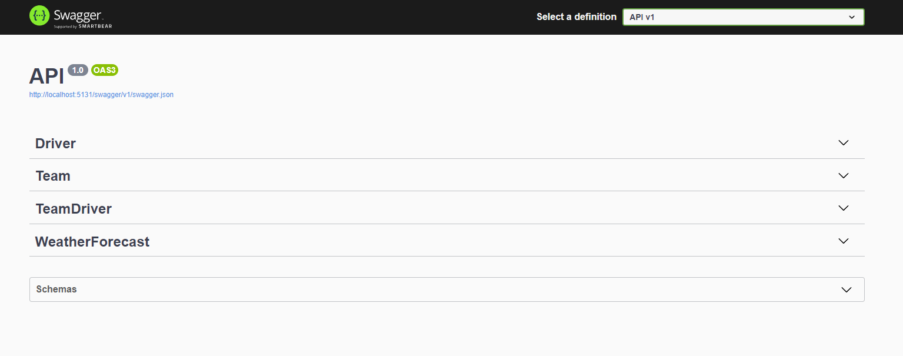
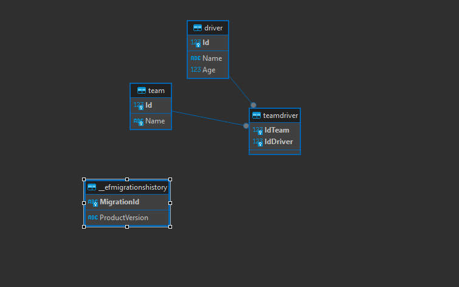
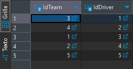
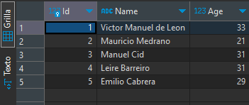
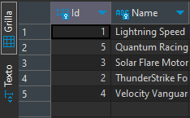

<h1 align="center"><b>Formula Race - DbFirst</b></h1>

Emplear el DbFirst de datos ya definidas, modificando la estructura de un proyecto de 3 capas y logrando una optima respuesta de migraciones habilitadas!

## Tecnologias 🧑🏻‍💻

 

- **Back-End Development**: 
   
   

- **Softwares & Tools**: 
   
   
   
   
  

- **Database**:
  

 

## Requerimientos funcionales 👻 
🔰 Genere la entidad de TeamDriver que es generada como un diccionario en el contexto. ✔  
🔰 Genere el archivo de configuracion de la entidad TeamDriver. ✔  
🔰 Genere una nueva migracion. ✔  
🔰 Genere repositorios y metodos crud. ✔  

## Preview project 👣
### 1. Queries:

### 2. Diagram-Database: FormulaRace:

### 3. Data-TablaIntermedia:

### 4. Data-Tabla: Driver:

### 5. Data-Tabla: Team:

### 6. Methods queries basic 🔄:
**Methods**: `GET`

**Obtener todos los conductores**: `http://localhost:5131/Driver`

**Obtener todos los equipos**: `http://localhost:5131/Team`

**Obtener todos los conductores y equipos**: `http://localhost:5131/TeamDriver`

**Methods**: `GET x ID`

**Obtener todos los conductores**: `http://localhost:5131/Driver/{id}`

**Obtener todos los equipos**: `http://localhost:5131/Team/{id}`

**Obtener todos los conductores y equipos**: `No Incluye`

**Methods**: `PAGINATION`

**Obtener todos los conductores**: `http://localhost:5131/Driver`

**Obtener todos los equipos**: `http://localhost:5131/Team`

**Obtener todos los conductores y equipos**: `http://localhost:5131/TeamDriver`

**Methods**: `POST`

**Obtener todos los conductores**: `http://localhost:5131/Driver`

**Obtener todos los equipos**: `http://localhost:5131/Team`

**Obtener todos los conductores y equipos**: `http://localhost:5131/TeamDriver`

**Methods**: `PUT`

**Obtener todos los conductores**: `http://localhost:5131/Driver`

**Obtener todos los equipos**: `http://localhost:5131/Team`

**Obtener todos los conductores y equipos**: `http://localhost:5131/TeamDriver`

**Methods**: `DELETE`

**Obtener todos los conductores**: `http://localhost:5131/Driver`

**Obtener todos los equipos**: `http://localhost:5131/Team`

**Obtener todos los conductores y equipos**: `http://localhost:5131/TeamDriver`

## You can help me by Donating 💰
   

## Autores:
- <a href="https://github.com/IgmarLozadaBolivar">Powered by Igmar</a> 